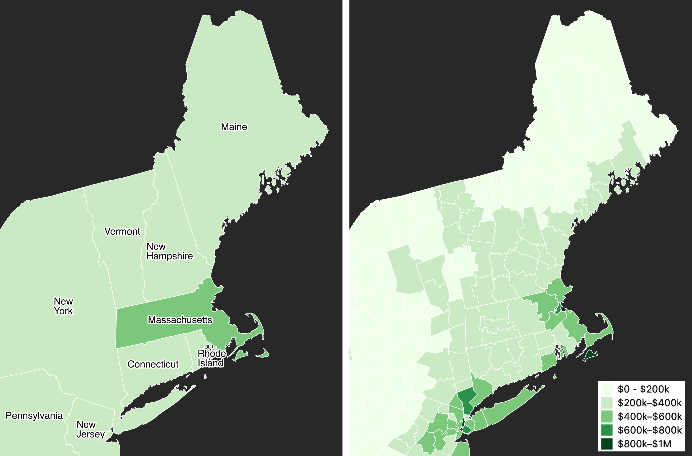

# zillow-choropleth
Use smaller geographies for choropleth maps – illustration.

### Data
* US state and county boundaries – courtesy of [Eric Celeste](https://eric.clst.org/tech/usgeojson/)
* August 2020 home values by [Zillow Research](https://www.zillow.com/research/data/)

### Credits
Map developed with QGIS and Figma by [ilyankou](https://github.com/ilyankou)
for Hands-On Data Visualization book.